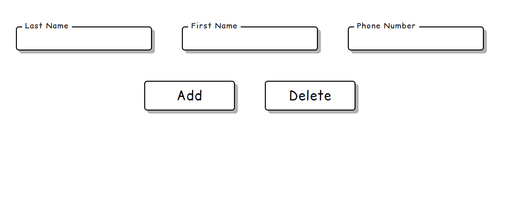

A simple and stylish contact manager built with **HTML, CSS, and JavaScript**.  
It lets you add, view, and delete people directly in your browser — all data is stored locally with `localStorage`.

---

## DEMO

**Live Demo:** [🌐 Check it out here!!! 🌐](https://telephone-agenda.vercel.app)



---

## ✨ Features

- ➕ Add new contacts  
- ❌ Delete existing ones  
- 💾 Persistent storage using `localStorage`  
- 💫 Smooth transitions and subtle animations (shake on input errors, button flips)
- 🌙 Toggle between **light** and **dark** themes


---

## 🧩 Tech Stack

| Tech | Purpose |
|------|----------|
| HTML5 | Structure |
| CSS3 | Styling and theme switching |
| Vanilla JS | Logic, DOM updates, and data persistence |

---

## 🚀 How to Run

1. Clone this repository:
   ```bash
   git clone https://github.com/costiz7/telephone-agenda.git

